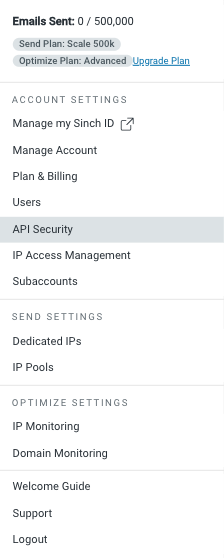
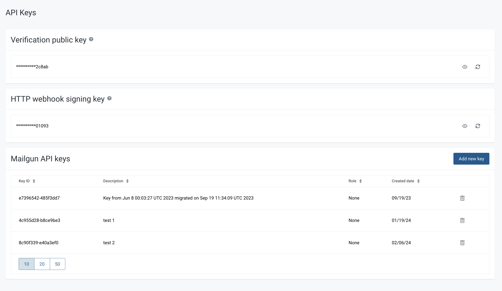
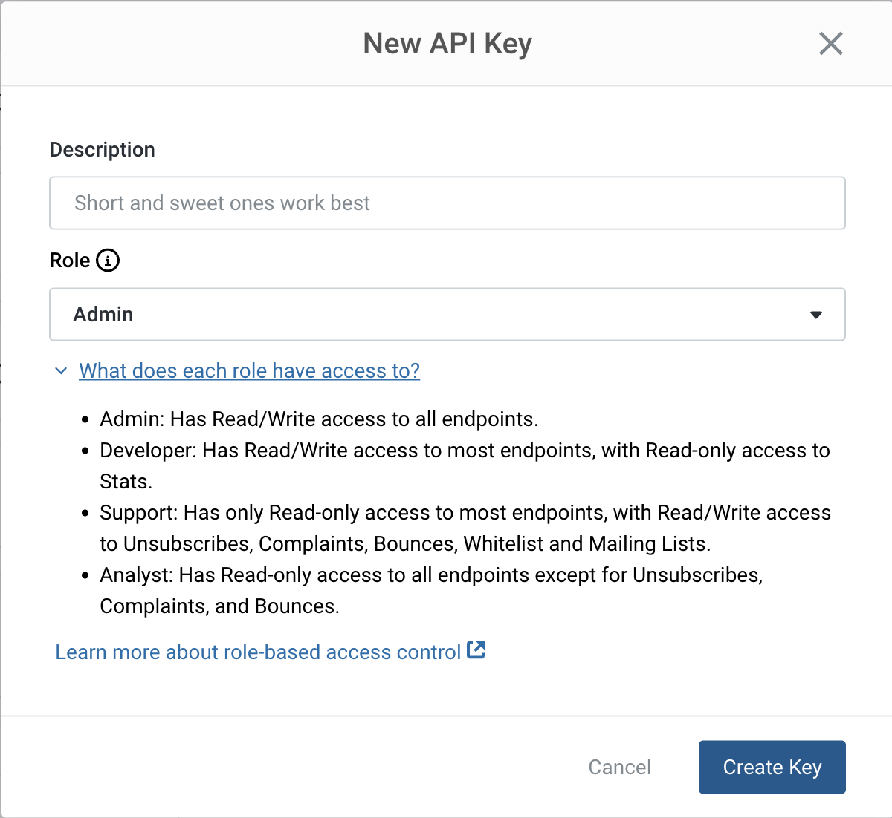

# Email gateway accounts

## Sendgrid

API keys


Below is a copy of the original Twilio article available by the link: [https://www.twilio.com/docs/sendgrid/ui/account-and-settings/api-keys](https://www.twilio.com/docs/sendgrid/ui/account-and-settings/api-keys)


1. Navigate to **Settings** on the left navigation bar, and then select **API Keys**.
2. Click **Create API Key**.
3. Give your API key a name.
4. Select **Full Access**, **Restricted Access**, or **Billing Access**.
5. If you're selecting **Restricted Access**, or **Billing Access**, select the specific permissions to give each category. For more information, see [API key permissions](https://www.twilio.com/docs/sendgrid/ui/account-and-settings/api-keys#api-key-permissions).
6. Click **Create & View**.
7. Copy your API key somewhere safe. For security reasons, do not put it directly in your code, or commit it somewhere public like GitHub.

## Mailgun

API keys


Below is a copy of the original Mailgun article available by the link: [https://help.mailgun.com/hc/en-us/articles/203380100-Where-can-I-find-my-API-keys-and-SMTP-credentials](https://help.mailgun.com/hc/en-us/articles/203380100-Where-can-I-find-my-API-keys-and-SMTP-credentials)


1. In the top-right corner of the **Mailgun Control Panel**, _click_ your **Profile Menu** to expand the drop-down list of options.\
   
2. Next, _click_ the **API Security** option. Alternatively, you can use [**this direct link**](https://app.mailgun.com/settings/api_security). \
   
3. The resulting page displays the Verifications Public Key, HTTP Webhook Signing Key, and most importantly for our present purpose, the Mailgun API Keys. To create the new key, _click_ the **Add new key** button.\
   
4. Finally, _type_ a description, _choose_ a role, and _click_ the **Create Key** button in the pop-up modal to confirm creation of the new Mailgun API Key.\
   

