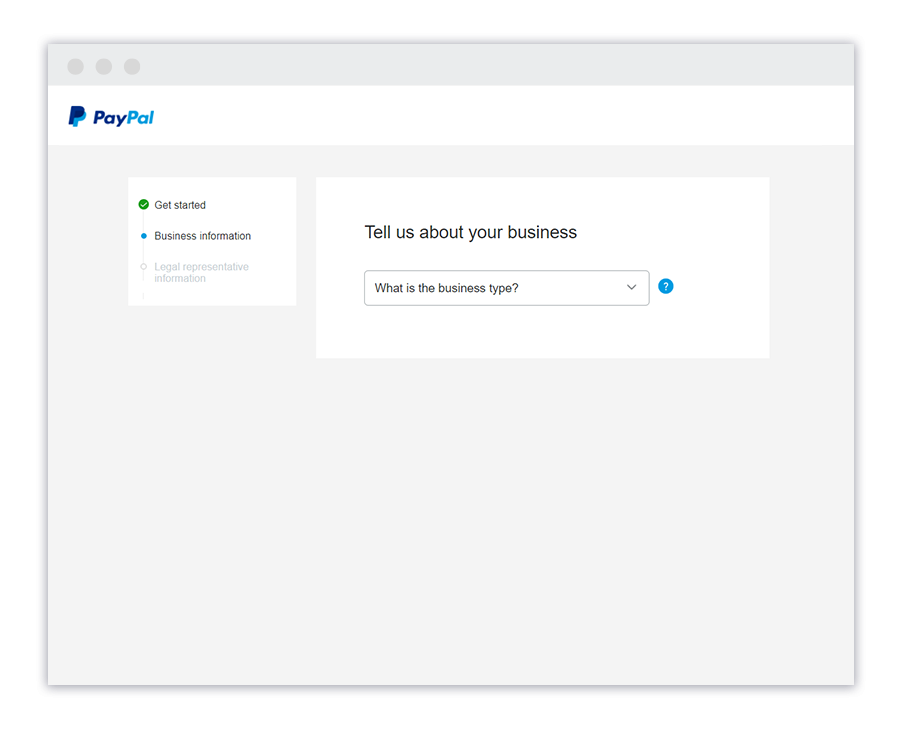
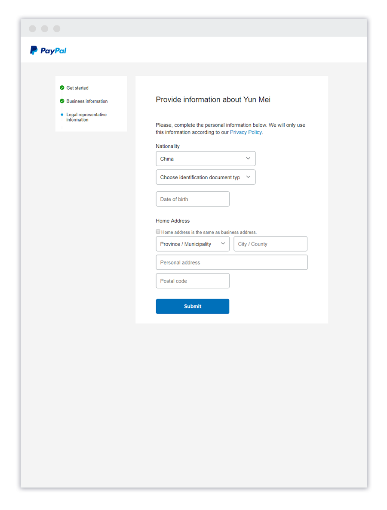
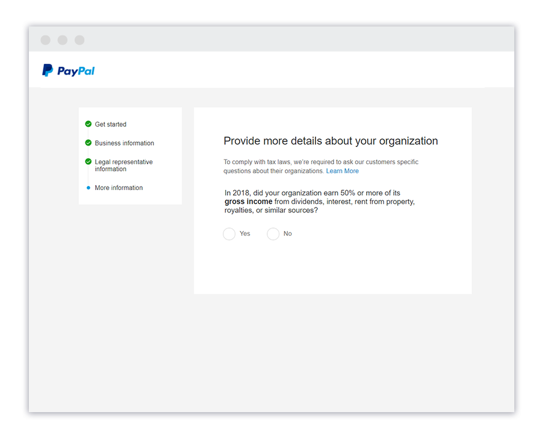
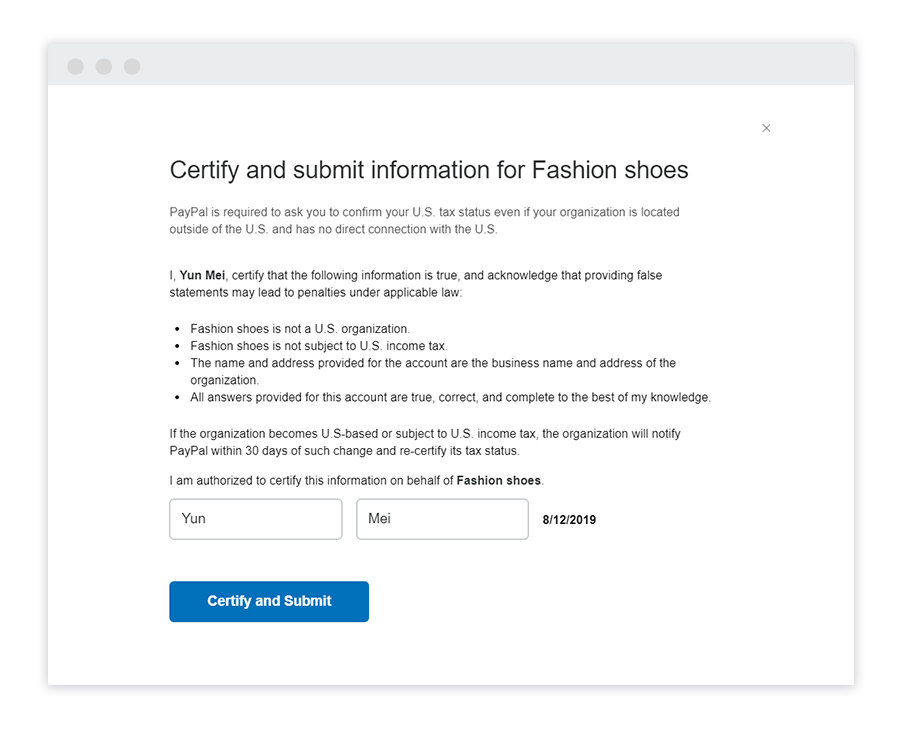
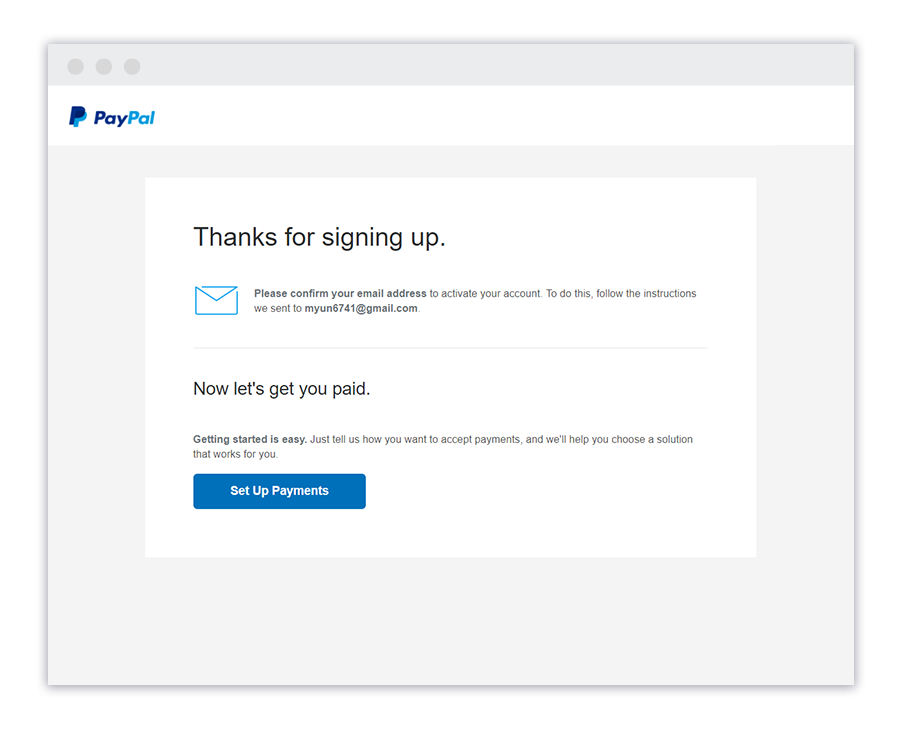
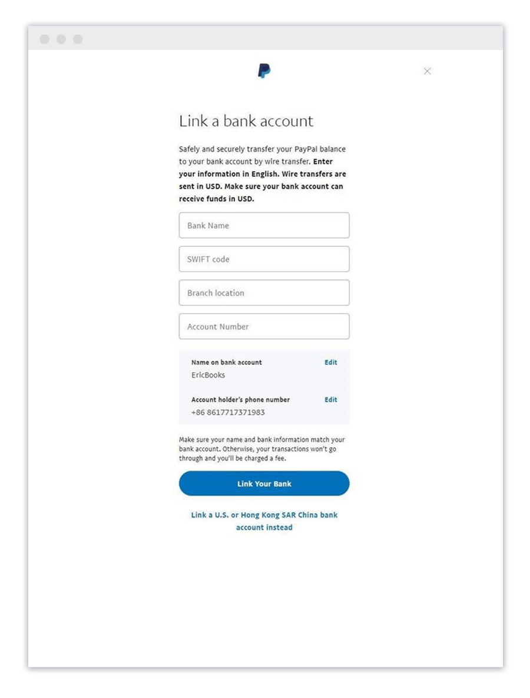
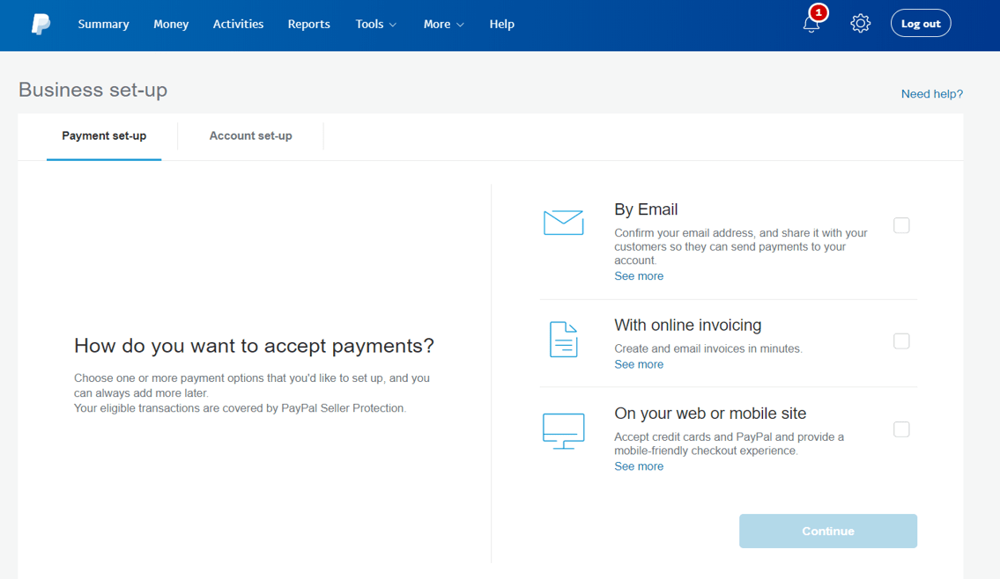

# Payment gateway accounts

## Stripe

Register your Stripe account: [https://dashboard.stripe.com/register](https://dashboard.stripe.com/register)

### Activate your account

In order to activate your account, fill out the account application available the link: [https://dashboard.stripe.com/account/onboarding](https://dashboard.stripe.com/account/onboarding). Specify there basic information about your business, product and personal info. Once your account is activated, you start accepting payments.


After activation you can't change the country. If you need to work with different countries, create a new account.


Note that Stripe follows “Know Your Customer” (KYC) and collection information about users. It's needed to match the regulatory rules and prevent a fraud. They may contact you in order to confirm the information you provided before.

**To get a secret key in a sandbox:**

1. In the Developers Dashboard, open the **API keys** tab.
2. In the **Standard keys** > **Secret key** row, click **Reveal test key**.
3. Copy the API key and paste in the TVMS. It's better to save it somewhere else in a secure place.

**To get a secret key in live:**

For security, in live mode Stripe only shows you a secret or restricted API key one time. Store the key in a safe place where you won’t lose it. To help yourself remember where you stored it, you can leave a note on the key in the Dashboard. If you lose the key, you can roll it or delete it and create another.


**You can't reveal a live mode secret key that you created**

After you create a secret or restricted API key in live mode, we display the value before you save it. You must copy the value before saving it because you can’t reveal it later. You can only reveal a default secret key or a key generated by a scheduled roll.


* In the Developers Dashboard, open the **API keys** tab.
* In the **Standard keys** list or **Restricted keys** list, in the row for the key you want to reveal, click **Reveal live key**.
* Copy the key value by clicking it.
* Save the key value.
* Click **Hide test key**.
* Click the overflow menu (\*\*\*) next to the key, then select **Edit key**.
* In the **Note** field, enter the location where you saved the key, then click **Save**.
* If you created the key before Stripe introduced this feature, click **Hide live key**.

## PayPal


The following information got from the official PayPal documentation [https://www.paypal.com/c2/webapps/mpp/how-to-guides/sign-up-business-account?locale.x=en\_C2](https://www.paypal.com/c2/webapps/mpp/how-to-guides/sign-up-business-account?locale.x=en_C2)


Before signing up for your PayPal Business account, ensure that you have the correct ID information on hand.You’ll need your business registration information, business license and legal representative’s ID document.

### Account creation

1. All you need are basic details such as your business name, contact details, and which currency you want to send and receive payments in. Make sure the name you use is identical to the one showing on your business license to prevent security issues.\
   
2. Please fill in details such as, product/service keywords, company URL (if applicable), country of registration, Business registration number and date of registry.\
   
3. Let know more about yourself, your country of birth and your current country of residency. If you do not have a National Identity Card, you may also sign up with your passport number or other photographed national ID.\
   \
   
4. Provide more details about your organization. Please then certify the information and click 'Submit'.\
   
5. You should have received an email from us once you signed up for an account. Simply click on the link in the email to confirm your email address. If you can’t find the email, you can click the Profile icon in your PayPal account to request for another one.\
   
6. Linking your bank account gives you another option to pay with the security of PayPal’s encryption and data protection. You can withdraw funds from PayPal to your bank account once you’ve [linked your account](https://www.paypal.com/c2/webapps/mpp/how-to-guides/activate-your-business-account?locale.x=en_C2).\
   

### How do I create Client ID and Secret Key?

This info has been taken from [https://www.paypal.com/us/cshelp/article/How-do-I-create-REST-API-credentials-ts1949](https://www.paypal.com/us/cshelp/article/How-do-I-create-REST-API-credentials-ts1949)

* Log in to the [PayPal Developer Portal](https://developer.paypal.com) using the same credentials you use for [PayPal](https://www.paypal.com).
* On the [Apps & Credentials](https://developer.paypal.com/dashboard/applications/sandbox) page, click **Live** or **Sandbox** depending on whether you need an app for testing (Sandbox) or going live (Live).
* Click **Create App** in the upper right corner.&#x20;
* Enter the name of your REST API app in the **App Name** field, select **Merchant** or **Platform** as the type of application, and select a **Sandbox business account** to associate with your app.&#x20;
* Click **Create App**.\
  Your credentials, the client ID and secret, are displayed on the app details page that displays after you click **Create App**.
* Request permissions for REST API features that apply to your integration, such as:
  * Invoicing API
  * PayPal Here
  * Subscriptions
  * PayPal payments
  * Connect with PayPal
  * Customer Disputes API
  * Payouts
  * Advanced Credit & Debit Cards
  * Vault

## Chapa

1. In order to register an account, go to [https://dashboard.chapa.co/register](https://dashboard.chapa.co/register)&#x20;
2. There, specify all the required fields like full and last name, login, password, etc.

Once your account is created, you may specify more business information in order to activate the Live mode.

API Keys are available by the link: [https://dashboard.chapa.co/dashboard/profile/compliance#api-tab](https://dashboard.chapa.co/dashboard/profile/compliance#api-tab)

## PayFast

1. In order to create an account, go to [https://registration.payfast.io/](https://registration.payfast.io/)
2. On Step 1, specify email, password, account type
3. On Step 2, specify your Display name, Industry, phone number, etc.
4. On Step 3, specify your location
5. On Step 4, specify your banking details like your bank and account number
6. Finally, specify your personal info using your SA ID or Passport

To find your Merchant ID and Key do the following:

1. Log in to your PayFast account.
2. Navigate to Account > Personal Information.
3. Your Merchant ID and Key can be found on the top right-hand corner of the page.

## Paystack

Registration is pretty easy, please follow the link: [https://dashboard.paystack.com/#/signup](https://dashboard.paystack.com/#/signup)

There, specify your name, email and other required fields, then you receive a mail you can use for a verification.

When you have it activated, go to [https://dashboard.paystack.com/#/settings/developers](https://dashboard.paystack.com/#/settings/developers) and copy Secret key to use in the TVMS.

## Flutterwave

Go to [https://app.flutterwave.com/register](https://app.flutterwave.com/register) to create an account. Specify your country and account type. On the next step, specify you company and personal name, email, password, etc., don't forget to confirm you email.

Once you're registered, go to [https://app.flutterwave.com/dashboard/settings/apis/live](https://app.flutterwave.com/dashboard/settings/apis/live) copy and paste the secret key in the TVMS
