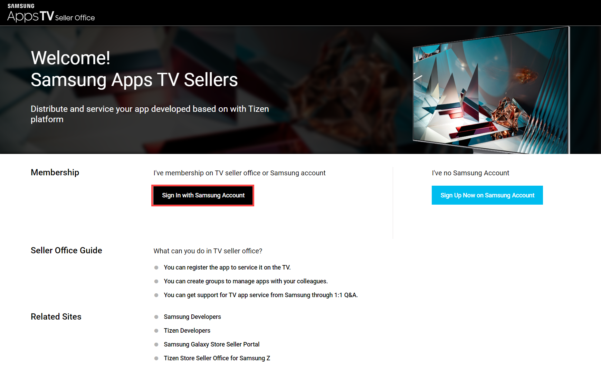
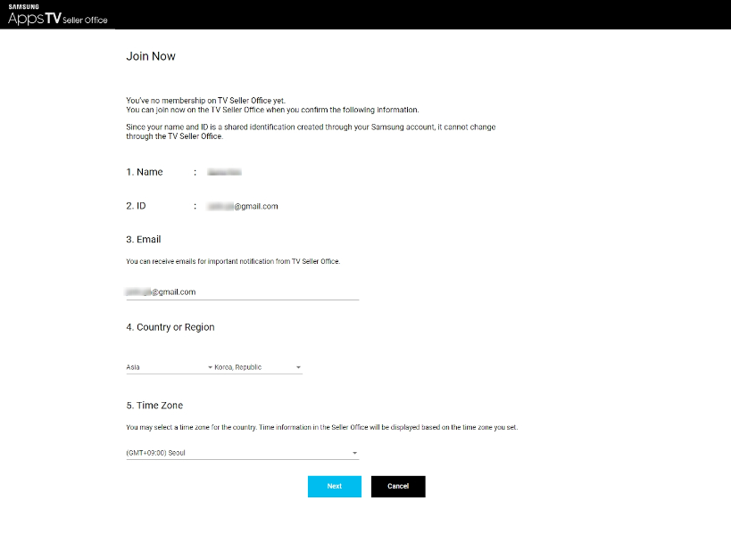
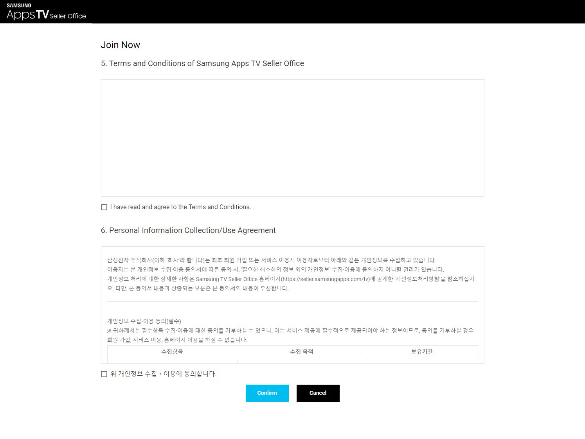

# Register Developer Account

Setting up your Developer Accounts and granting us access is a crucial part of the process.

If you're setting up your Developer Accounts for the first time, you can find below all the information you need. If you already have Developer Accounts, please review the information below to find how to grant us with access.

We suggest you start with creating your Developer Accounts at start of the project, to prevent delays later on.


Your Developer Accounts should be associated with the same legal entity or organization, who has the rights to distribute the content.


## Apple Developer Account

You need to enroll in the Apple Developer Program as an **Organization**. To do this, you’ll need your Apple ID as well as a D-U-N-S number. By joining the Apple Developer Program you will enter into contracts with Apple, so you must have the ability to enter legal agreements on behalf of your organization.

Create Apple Developer Account

#### Create your Apple Account when you set up your device

1. First, tap "Forgot password or don’t have an Apple Account?"
2. Then, Create a Free Apple Account.
3. Specify your birthday and your name, password and other fields, then click Continue
4. Specify your email, then you will use this address to access your Apple account. You can also create a new email in iCloud by "Don’t have an email address?" link.
5. Follow the steps to verify your email, specify a password and other required info.

#### Create your Apple Account using the App Store on your device

1. Open the [Apple Developer](https://developer.apple.com/) portal and tap the Account button.
2. Click [Create yours now](https://appleid.apple.com/account?appId=632\&returnUrl=https%3A%2F%2Fdeveloper.apple.com%2Faccount%2F).
3. Specify your birthday and your name, password and other fields, then click Continue
4. Enter your payment and billing information, click Next.&#x20;
5. Then you have to confirm the phone number and click Next
6. Follow the steps in a mail by Apple to verify your email.

D-U-N-S number

## D-U-N-S® Number


Below is a copy of the original Apple article available by the link: [https://developer.apple.com/support/D-U-N-S/](https://developer.apple.com/support/D-U-N-S/)


The D-U-N-S Number is a unique nine-digit number that identifies business entities on a location-specific basis. Assigned and maintained by Dun & Bradstreet (D\&B), the D-U-N-S Number is widely used as a standard business identifier.

Your D-U-N-S Number will be used to check the identity and legal entity status of your organization as part of our enrollment verification process for joining the Apple Developer Program or the Apple Developer Enterprise Program. While many types of businesses can receive a D-U-N-S Number, your business must be recognized as a legal entity (such as a corporation, limited partnership, or limited liability company) to enter into the legal terms and obligations of Apple Developer Program agreements. DBAs, fictitious businesses, trade names, and branches are not accepted.

Companies and educational institutions must provide a D-U-N-S Number registered to their legal entity. A D-U-N-S Number is optional for government organizations. If you're enrolling as an individual, you don't need a D-U-N-S Number.

### Requesting a D-U-N-S Number

D\&B may have already assigned your organization a free D-U-N-S Number. Before enrolling, [look up your organization](https://developer.apple.com/enroll/duns-lookup/) to see if you have a D-U-N-S Number. If your company is not listed, you’ll have the option to submit your information to Dun & Bradstreet for a free D-U-N-S Number.

You'll be asked for the following information when looking up your organization:

* Legal entity name
* Headquarters address
* Mailing address
* Your work contact information

As part of their verification process, a D\&B representative may contact you directly for more information (such as your business type or number of employees). Please have your business registration documents ready.

### Receiving and managing your D-U-N-S Number

After requesting a D-U-N-S Number, please allow up to 5 business days to receive your number from D\&B. Expediting your D-U-N-S Number creation process will not shorten this waiting period. If your application has taken longer than two weeks to process, please [email D\&B](https://support.dnb.com/?CUST=APPLEDEV).

Once you receive your D-U-N-S Number, please allow up to 2 business days for Apple to receive your information from D\&B. After this period, you may enroll as a company/organization in the Apple Developer Program.

To update your D\&B profile, [email D\&B](https://support.dnb.com/?CUST=APPLEDEV). Please note that it takes up to two business days for D\&B to provide updated information to Apple.

### During enrollment I received the message, "Your organization is not listed as a legal entity." What does this mean?

The business you entered is either listed in the D\&B database with a different legal status (such as a sole proprietorship), or its legal status has not been verified. When enrolling, make sure to use the legal entity name of your organization, as Apple does not accept DBAs, fictitious businesses, trade names, or branches for enrollment as a company/organization. If your legal status is a sole proprietorship/single person business, [enroll as an individual](https://developer.apple.com/programs/enroll/). If you believe your business should be listed as a legal entity, have your business registration documents ready and [email D\&B](https://support.dnb.com/?CUST=APPLEDEV). Complete business registration documents are required to verify your organization’s legal status.

Complete registration, then send us the [invitation](https://help.apple.com/developer-account/#/dev3e8818774) to **apps@iptvmiddleware.com** to your team with the **Admin** role and with access to the **Certificates, Identifiers & Profiles** section.

## Google Play Developer Account 

To create a new Google Play Developer account, complete the steps from the following [article](https://support.google.com/googleplay/android-developer/answer/6112435?hl=en#zippy=%2Cstep-sign-up-for-a-google-play-developer-account). Please make sure to create Organization type of account.


It is very important to select Organization type, because Individual accounts have limitations on Google Play side.


Create Google Developer Account


Info below got from the Google article available by the link: [https://support.google.com/googleplay/android-developer/answer/6112435](https://support.google.com/googleplay/android-developer/answer/6112435)


### Register for a Play Console developer account

1. Sign up for a Play Console developer account
   1. [Sign up for a Play Console developer account](https://play.google.com/apps/publish/signup).
   2. Then, you can start using Play Console to [publish and manage the apps](https://developer.android.com/distribute/googleplay/developer-console.html).
2. You have to accept the Developer Distribution Agreement
3. In order to use Google Play, you have to pay the registration fee - 25$&#x20;
4. Choose a developer account type: Personal or Organization.&#x20;
5. Verify your developer identity information
6. Meet testing requirements and device verification requirements

After the account is created, send us the [invitation](https://support.google.com/googleplay/android-developer/answer/9844686?hl=en\&visit_id=637595215236383957-3666748548\&rd=1) to **apps@iptvmiddleware.com** with the **Admin** role towards to your account.

## Amazon Developer Account 

Create Amazon Developer Account


Below is a copy of the original Amazon article available by the link: [https://developer.amazon.com/docs/app-submission/manage-account-and-permissions.html](https://developer.amazon.com/docs/app-submission/manage-account-and-permissions.html)


### Create a developer account

You must create an Amazon developer account in order to publish an app in the Appstore. If you already have an Amazon.com account but not an Amazon developer account, you can optionally sign in with your Amazon.com account. The Developer Console automatically creates a developer account using your Amazon.com email address, and the two accounts are tied together and synced. When signing in, you are prompted to complete the registration profile pages in the Developer Console.

To create a new Amazon developer account:

1. Go to [https://developer.amazon.com](https://developer.amazon.com/).
2. Click **Sign In** in the upper-right corner.
3. Click **Create your Amazon Developer account**.
4.  Complete the requested fields for your name, email, and password, and then click **Create your Amazon Developer account**.

    You're prompted to enter a One Time Password (OTP) sent to the email address you provided. (If this One Time Password dialog doesn't appear, your corporate VPN might be blocking the page. Try disconnecting from VPN.)
5. Go to your email to retrieve the OTP. Enter it into the **Enter OTP** field and click **Create your Amazon account**.
6. When you log in to your developer account, you might be prompted to add a mobile phone number to enhance the security of your account. Add your number and complete the verification process.
7.  You're now signed in to the Developer Console and presented with a Developer Registration screen. Complete the information fields in the **Developer Details** and **Contact Details** sections.

    When you later publish an app, you'll have the option to associate the Contact Details here for your App Details page in the Appstore listing. You can also supply different contact details when you publish your app. On your App Details page, the email address and company site appear in a "Developer info" section, while the "Developer/Company name" appears below your app title.

    Most of these fields are basic information fields that you can update later as needed. However, the **Developer/Company name** field cannot be edited after you click **Submit** (except by filing a support case).
8. In the **Amazon Developer Services Agreement** section, click the link to read the agreement, and then click the **I agree** button. You can always read this legal agreement more carefully here: [Amazon Developer Services Agreement](https://developer.amazon.com/support/legal/da). This agreement is required to distribute your app.
9. Click **Submit**. A "Welcome" screen appears with options to customize your interests as well as received product information and updates.
10. Select the desired checkboxes and then click one of the following:
    * **Continue completing your profile** — this takes you to the Settings tab. For a brief description of the subtabs available here, see [Settings subtabs](https://developer.amazon.com/docs/app-submission/manage-account-and-permissions.html#settings_tab).
    * **Start exploring the console** — this takes you to the Dashboard (shown below), which has quick links for common actions.

The Developer Console acts as a configuration portal for different Appstore-related products. Each product often has its own configuration screens, tabs, and branding.

### Add users to your organization's developer account

If your company has multiple users who work on app development and submission, you can give them access to your company's account. You can also assign each user a role that limits their permissions within your account. As an account owner, you are responsible for all activities that occur under the accounts you authorize.

To share your account with another user:

1. Sign in to the Developer Console.
2. Go to **Settings** > **User Permissions**.
3. Click **Add New**.
4. Type the user's email address and select his or her role. Four options are available, each with unique permissions. Choosing the correct user permissions for each user allows the account owner to control what each user can see or do in the company's developer account. Available roles are as follows:
   * **Administrator**: This role grants complete access to all sections of the developer account, including reporting and payment information. Most importantly, any account administrator has the ability to manage user permissions, including inviting or removing users from the account.
   * **Developer**: Outside of an Administrator, this is the only role that gives users the ability submit and adjust application files.
   * **Marketer**: Outside of an Administrator, this is the only role that gives users the ability to edit the content associated with apps (for example, descriptions and images) and IAPs. Like the Analyst, this role also gives access to sales reports.
   * **Analyst**: Outside of an Administrator, this is the only role that gives users the ability to view earnings reports. Like the Marketer, this role also gives users access to sales reports.

After you finish adding users and configuring roles, click **Save**.

### Find your customer and vendor ID

At times, Amazon teams might need your customer and vendor ID in order to give access to certain programs or documentation pages using an allow list. You can find your customer and vendor ID by doing the following:

1. Sign in to the Developer Console.
2.  Go to [https://developer.amazon.com/mycid.html](https://developer.amazon.com/mycid.html).

    Your customer ID and vendor ID are shown on the screen.

After the account is created, send us the [invitation](https://developer.amazon.com/docs/app-submission/manage-account-and-permissions.html#add_other_users) to **apps@iptvmiddleware.com** with the **Administrator** role.

## LG Developer Account 

LG Developer Account


Below is a copy of the original LG article available by the link: [https://seller.lgappstv.com/seller/support/userGuide/RetrieveUserGuide.lge?pstgSeq=9](https://seller.lgappstv.com/seller/support/userGuide/RetrieveUserGuide.lge?pstgSeq=9)


1. Select the country in which you are currently residing and tap the Sign up button.
2. Accept the Terms and Conditions and tap Next.
3. After filling out the required fields and clicking the Send verification code button, an account verification email will be sent.
4. In your inbox, open the email with the subject '\[LGE Account] Email Verification' and enter the verification code.
5. Click the Next button to move to the Additional Information page in the Seller Lounge.
6. To finish signing up, you must fill out the required fields on the Additional Information page.

After the account is created, share the credentials to your account with your project lead from MwareTV team.

## Samsung Developer Account 


By default your new account will have possibility to launch TV application services **only in the United States**. In order to launch TV application services in countries other than the U.S, you need to get a **partnership**.

For more information, refer to the [Becoming Partners](https://developer.samsung.com/tv-seller-office/guides/membership/becoming-partner.html) guide.


Samsung Developer Account


Below is a copy of the original Samsung article available by the link: [https://developer.samsung.com/tv-seller-office/guides/membership/becoming-seller-office-member.html](https://developer.samsung.com/tv-seller-office/guides/membership/becoming-seller-office-member.html)


On the first screen of the TV Seller Office, log in with your Samsung Account. If you are not already a member of the TV Seller Office upon login, you are presented with a sign-up page.

First screen of TV Seller Office

Join membership of TV Seller Office

On the TV Seller Office sign-up screen, you must fill in the subscriber's email address, country, and time zone information.

After entering the information, review the TV Seller Office Terms of Use and Privacy Policy, and check the check box to indicate your agreement.

After agreeing, click "Confirm" and you become a member of the TV Seller Office and are taken to the main screen.

After the account is created, share the credentials to your account with your project lead from MwareTV team.

## Roku Developer account

Roku Developer Account

### Create your Roku account on the Roku website 


Below is a copy of the original Roku article available by the link: [https://support.roku.com/article/115015595647](https://support.roku.com/article/115015595647)


To sign up for a Roku account go to [my.roku.com/signup](https://my.roku.com/signup) and follow these steps:

1. Enter your first and last name, email, a [strong, unique password](https://support.roku.com/article/115016130788), date of birth, and gender and select Continue
2. Select a [PIN and parental control settings](https://support.roku.com/article/220128567), which allows you to control what can be purchased or what apps can be added to your devices
3. Add a [payment method](https://support.roku.com/article/208755978) to be able to quickly sign up for free trials and subscriptions and make purchases on your TV
4. Select Save and Continue

Enroll in the [Roku Developer Program](https://developer.roku.com/enrollment/standard).

Complete configuration of your Roku Developer account by:

* verifying your account's email address;
* [linking a Roku device](https://support.roku.com/article/360000321787);
* [adding a payment method](https://support.roku.com/article/208755978) (if it wasn't done on the account creating step).

After the account is created, share the credentials to your account with your project lead from MwareTV team.
