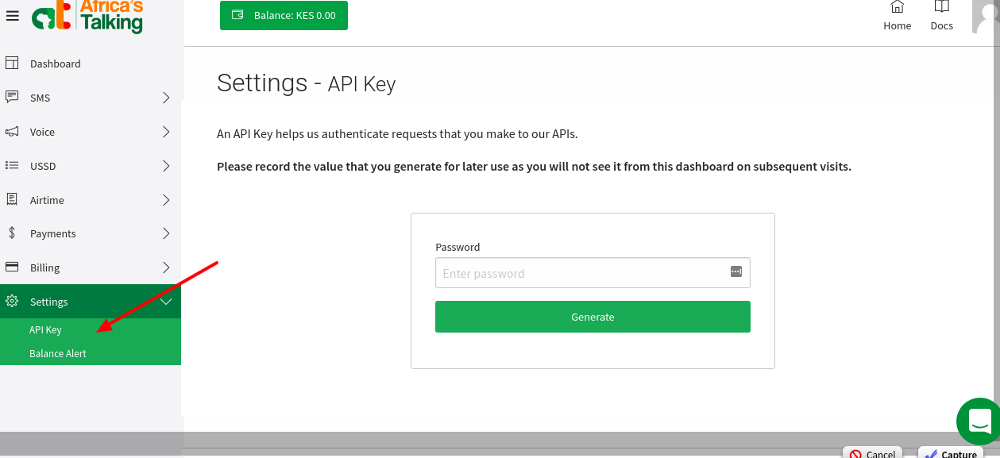

# SMS gateways accounts

## Twilio

<details>

<summary>API keys</summary>


Below is a copy of the original Apple article available by the link: [https://www.twilio.com/docs/iam/api-keys/keys-in-console](https://www.twilio.com/docs/iam/api-keys/keys-in-console)


* Click **Admin > Account management** in the top right corner.
* Under **Keys & credentials**, click **API keys & tokens** (or go directly to the [Console](https://www.twilio.com/console/project/api-keys)).
* On the **API keys & tokens page**, click **Create API key**.
* On the **Create new API key** page, enter a **Friendly name** for the API key.
* Select the **Region** and the key type: **Standard**, **Main**, or **Restricted**. Restricted API keys are only available in the United States Region.
* For Restricted keys, select the **Permissions** to grant.
* Click **Create**.
* On the **Copy secret key** page, **Copy the secret** and store it somewhere secure.
* Select the **Got it!** checkbox and click **Done**.

</details>

## Africa's Talking

<details>

<summary>API keys</summary>


Below is a copy of the original Apple article available by the link: [https://help.africastalking.com/en/articles/1361037-how-do-i-generate-an-api-key](https://help.africastalking.com/en/articles/1361037-how-do-i-generate-an-api-key)





Production/Live Users

1. Log into your account and got to your App dashboard
2. Click on Settings(on the menu on your left)&#x20;
3. Click on API Key
4. Enter your password and click Generate
5. Copy the API Key generated and paste it in your code or record it somewhere safe for later use because you will not see it from the dashboard on subsequent visits.

Sandbox Users

1. Log into your account , click on the orange Go To Sandbox App  button.
2. Click on Settings(on the menu on your left)&#x20;
3. Click on API Key
4. Enter your password and click Generate
5. Copy the API Key generated and paste it in your code or record it somewhere safe for later use because you will not see it from the dashboard on subsequent visits.


Once you've generated your API Key wait about 3 minutes before testing it.&#x20;


</details>

## Pindo

<details>

<summary>API keys</summary>

Refer to the Pindo documentation [https://github.com/pindoio/pindo-cli](https://github.com/pindoio/pindo-cli)

Install from PyPi using [pip](http://www.pip-installer.org/en/latest), a package manager for Python.

`pip install pindo-cli`

Don't have pip installed? Try installing it, by running this from the command line:

`$ curl https://raw.github.com/pypa/pip/master/contrib/get-pip.py | python`

`python setup.py install`

```
Usage: pindo [OPTIONS] COMMAND [ARGS]...

Pindo CLI
	
A simple Command Line Interface that allows you to authenticate with the Pindo API
	
https://www.pindo.io

<...>

Commands:<...>
  token          Request a token for using Pindo API.
```

Once you have installed **Pindo CLI** you're ready to go.

</details>


