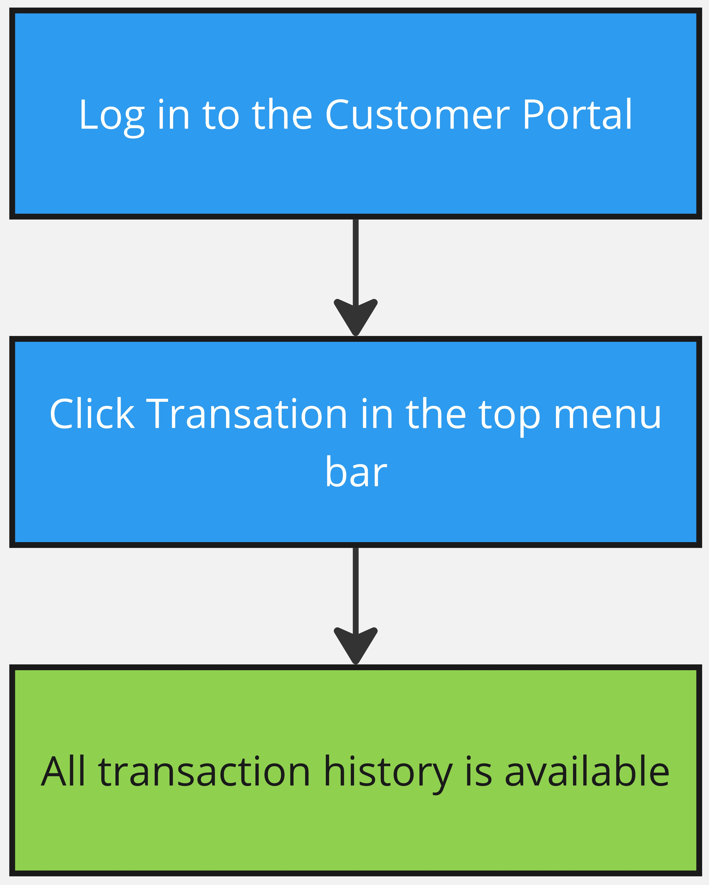

# Billing testing flows

Please, check whether the following points are completed:

1. [There is content available in bundles](../content/channels.md#bundles)
2. [Taxes are added](../inventory/taxes.md)
3. [Subscription settings match your business needs](../inventory/)
4. [There are subscriptions that includes these bundles](../inventory/)
5. [There are payment plans in the subscriptions](../inventory/inventory.md#manage-your-payment-plans)
6. [There are additional services (if any)](../inventory/services.md)
7. [Webshop translations are installed](webshops.md)
8. [Payment gateway works and added to the webshop](payment-gateways.md)
9. [Email/SMS gateway works and added to the webshop](email-gateways.md)
10. [Message templates and settings are defind and added to the webshop](message-templates.md)
11. [Subscriptions are added to the webshop](webshops.md)
12. [Application is up and running](../application/)

If everything is set up, please follow the steps below to check if everything work as expected.

## Subscriptions

### Subscription purchasing

Follow this chart to check if the webshop works as expected: subscription are displayed and can be purchased. It will also check if a payment gateway is available and works.

If you encounter any issues with the webshop, check its details and make sure everything is set up. Make sure that the subscription cost is enough for a payment gateway in use, note a currency that you use.

Check if all messages are received and well-formatted.

<figure><figcaption></figcaption></figure>

### Subscription expiration

Check how the TVMS behaves if a customer's subscription is expired. Account must be marked as Expired and inaccessible, a corresponding message is received.

<figure><figcaption></figcaption></figure>

### Autorecurring

Autorecurring allows to automatically charge users without additional confirmation. In prior, check if your payment gateway supports such an option, for example Stripe does.

Wait until a subscription gets expired, then check if a customer was billied. In result, the subscription must active and a corresponding message received.

<figure><figcaption></figcaption></figure>

### Subscription dunning

Dunning is an option to notify customer about a payment before a subscription expires.

It's handy if you don't use autorecurring, so customers know if it's time to charge.

Check if the corresponding messages are received.

<figure><figcaption></figcaption></figure>

### Change subscription on Portal


Portal let customers manage their subscriptions and personal data. Optionally, access may be intentionally denied if you provide service that doesn't require users actions.


When you log in to the Portal you can change your subscription. Open the wizard and follow the chart. In the end, you have another subscription and a corresponding message.

<figure><figcaption></figcaption></figure>

### Renew subscription on Portal

Portal also allows to renew subscriptions.

Follow the chart and make sure that your expired subscription is renewed, you was charged and corresponding messages were received.

<figure><figcaption></figcaption></figure>

### Upgrade subscription on Portal


This is optional and gives you a flexibility to tailor the subscription option to your business needs.


On Portal you may upgrade your subscription by choosing one that provides more content. Make sure you are asked to pay for the difference, billed and have access to the new service.

<figure><figcaption></figcaption></figure>

### Downgrade subscription


This is optional and gives you a flexibility to tailor the subscription option to your business needs.


Like for a subscription uprage, you can downgrade the subscription. In this case the difference of value will be returned in credits. Make sure that you can access the service, additional content is not available and you received a message.

<figure><figcaption></figcaption></figure>

### Partial upgrade subscription


This is optional and gives you a flexibility to tailor the subscription option to your business needs.


Partial upgrades can be handy to upsell additional products like CatchupTV, a TV channels bundle, etc.&#x20;

Create one, add it as an extra package to a subscription and check if you can purchase it.

In the end, the corresponding message is delieverd and a customer pays next time.

<figure><figcaption></figcaption></figure>

### Partial downgrade subscription


This is optional and gives you a flexibility to tailor the subscription option to your business needs.


Just like upselling, you can let customers to partial downgrade a subscription in use if they don't need additional content.

In this case no payment needed, a message receied, next time a customer pays less.

<figure><figcaption></figcaption></figure>

## Customers flow

### Customer portal flow

Check if the portal shows actual information about a subscription, devices, personal info.

<figure><figcaption></figcaption></figure>

### Login restrictions

TVMS provides a plenty of ways to manage the access in the app: geoblock, a maximum number of devices and their types and IP range.

You can permit users only from one or few countries, like the USA and Canada only or just don't select any country, then the service will be available worldwide.

Manage devices by its number and types. You can set the number from 1 to 5 and select suppported devices: allow them all or prohibit some.

If you apply any of this regulations, check them in the app.

<figure><figcaption></figcaption></figure>

### Change password on Portal

Customers can change their password in the app and in the Portal.

In this case, a corresponding message is sent with a password recovery link. Customer follows the link and changes the password, then it applies immediately.

<figure><figcaption></figcaption></figure>

### Personal info update

On the Portal, customers also can change their personal info, like a phone number, email and first with last names.

Try to change it for a test customer and see if the changes apply.

<figure><figcaption></figcaption></figure>

## Additional features

### Coupons

Using coupons, you can provide discounts. Create a coupon in Marketing and then use a vanity code in the webshop, in the end you get a discount and pay less.

<figure><figcaption></figcaption></figure>

### Taxes

TVMS also gives you an option to manage taxes that must be included in a final price.

Create taxes in Inventory and include it in a product, then check if an adjusted price is displayed in the purchase confirmation and if you were billed properly.

<figure><figcaption></figcaption></figure>

### Credits


This is optional, you can sell in-app content using Credits


The number of available credits is defined in the subscription details.

Set up PPV to pay with credits and check if you can purchase content and its number descreases after every transation.

<figure><figcaption></figcaption></figure>

### Transactions

Transactions in the Portal let customers see their billing history.

Use a test customer that was already billed, even multiple times and check if all these records are available and actual.

<figure><figcaption></figcaption></figure>
