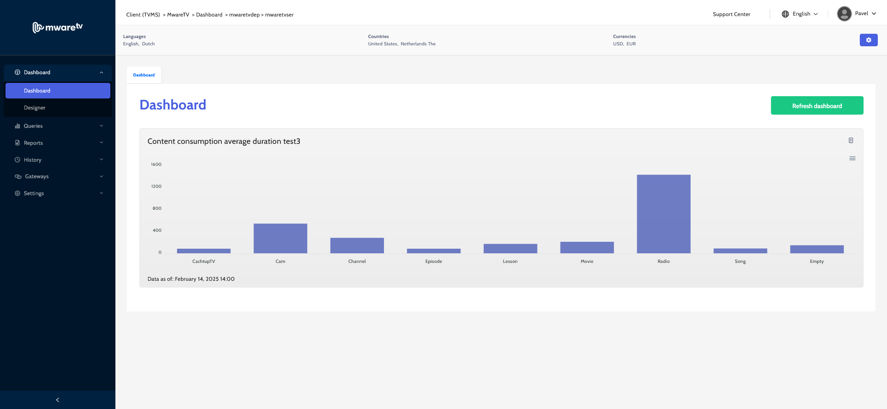

# Reports

TVMS provides a versatile reporting tool that empowers you to harness a variety of system entities for comprehensive data analysis. With the ability to visualize information through multiple chart types, you can create custom dashboards tailored to your specific needs. This flexibility allows for seamless integration of statistics into your workflow, enabling you to send reports via email effortlessly. By leveraging these capabilities, you can make informed, data-driven business decisions that enhance operational efficiency and drive strategic growth. Whether you’re tracking performance metrics or analyzing trends, TVMS equips you with the insights necessary to succeed in today’s dynamic business environment.

On the picture below you see a simple example of a chart on Dashboard. Follow the next pages to learn how to create one or multiple charts.

<figure><figcaption></figcaption></figure>
